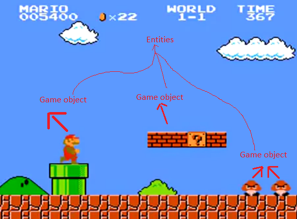

#  About Unity

Now that you have Unity installed. It's time to make sense of what's there on the screen. Not too fast though, before you actually start building there is some stuff you should know.

The Unity Engine is based on a data oriented tech stack called an Entity Component System(ECS). All three parts work together to make up your entire game.

Confused??😕 Let’s divide ECS into three parts-: 👇

 **Entity** → Entities are nothing but *game objects*. *Game Objects* are the objects that you see in a game. Say, you are playing “Super Mario”. You are the player(*Mario character)* through which you interact to kill the enemy (*a turtle*). In this scenario, both the Mario player and the enemy are game objects. The *red-brick* platform through which Mario and its enemies are moving is also a game object. In other words, each and every object that you see in a game is actually a game object *(Entity)*.
    
 
    
 **Component** → Components refer to the *properties* of entities. Properties can be anything, a game object’s height, position, color, or any data that represents it.

 **System** → It is the logic by which you can manipulate the values of the *components.* Suppose you want to change the height of an entity while playing the game. In “Super Mario”, the height of the main player (the entity) changes while achieving some bonus points. You can do all of such manipulation with the help of some logic. That logical process is what the S*ystem* refers to.

Understanding ECS is important as it forms the core of how Unity functions and as your games get bigger. Having a good grip over ECS iss going to be crucial.

Ok let's just revise it before we move on to the next section. Shall we?

