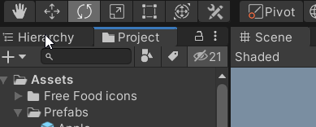
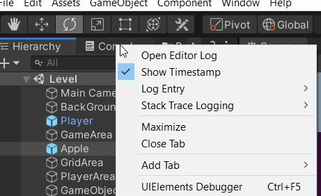

# Layout

## Overview

I am hoping that you have understood what ECS is and thus allowing you to open a new project in Unity 😏

When you open Unity for the first time, it is easy to get confused with all the windows and tools that show up. Ignore all the fluff and let's try one thing at a time.

Unity allows you to customize its layout to your liking and use only the currently required Views. Click-dragging any tab of any view helps us to move and position the View where we want it to be, we can also detach the Window from the Editor if we want. You can try the following.

Let's try click-dragging the hierarchy window :

Drag the *The Project tab* and attach it beside the Hierarchy tab: 

*The Hierarchy tab* can also be completely detached from the Editor and can be used as a floating window.

## Note:🔴

A View can have multiple tabs, in which case these tabs can be shown only one at a time, for eg, below, we can see Hierarchy and Project tabs in the same view, in this case, we can open up either the Project Tab or Hierarchy tab only one at a time, of course, tabs can be shifted elsewhere as shown above if they need to be viewed simultaneously.
    

    
 Whenever you are working in tabbed views, the “active” tab (the tab that has focus) has a thin blue stripe at the top, like in the above screenshot, you can see the Project tab having a thin blue stripe

 When multiple tabs are attached to a view that takes up more space than provided, Unity provided small directional arrows to look at the tabs that aren’t visible, for eg, below you can see 3 tabs in one view, but the Project tab isn’t visible,you can click on the arrow to get access to more tabs :
    
    

    

At any time, you can right-click on a tab and a pop up menu will show up with the different options specific to the tab, for eg, the below pop up menu is shown for the Console tab:
    
    

    

Finally, once you have decided on your own layout of the editor with required tabs and views, you also have the option to save the layout using the *Layout* options found under the layout dropdown (top right corner of Editor), then you can quickly switch back to your saved layouts if any changes are made to the current layout at any point:
    

## Wrapping Up
    
Please have a good layout in place for your projects. It will help you speed up your development and it helps me with my OCD. 

Set everything up quickly and meet me at the next section. 

