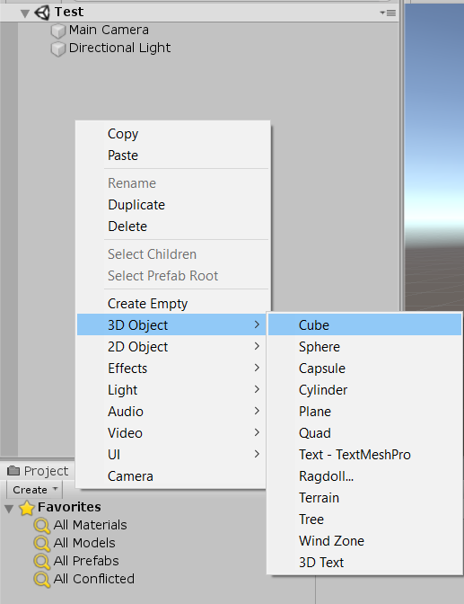
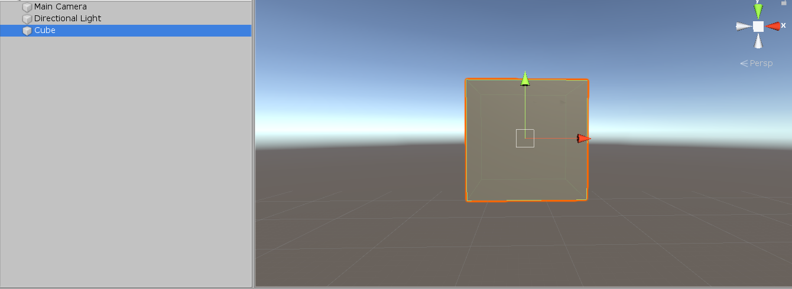

#  Toolbar and Navigation in Unity Editor

Ok so you have organized your layout neatly. Let's see if your layout is actually helping you in your productivity.

## Your First GameObject

Let's build our first GameObject. Right Click on an empty area inside the Hierarchy and go to 3D Object -> Cube

Ok before we move further, this is a big moment. You just made your first GameObject! It may seem small but you should celebrate your small victories as well.

Ok, got a little carried away there. Back to business.

## Navigation

The scene view will be the where you will be able to see and manipulate all of your game objects. 

The Toolbar at the top of the Editor will allow you to navigate around the scene view and positioning or moving GameObjects.

Click anywhere inside the scene view and try the following. ⬇️

Pan – Pan around the scene. Hold the Alt key and click-drag with the middle mouse. You can also hold Alt+Ctrl and click and drag

Zoom - Zoom in and out of scene view, hold the Alt key, and right-click and drag

Rotate – To rotate in the scene view, hold the Alt key and click and Drag

## Modifying GameObjects

Before trying the next actions. Select the Cube Object that you just created. If you cannot see it in scene view Double Click on it and the scene view should show up automatically.

Hand tool (Hotkey Q) – Allows you to click and drag around in Scene view

Move tool (Hotkey W) – Move the object in the scene view. Also, click and drag on the arrow pointing along the desired axis

Rotate tool (Hotkey E) – Rotate the objects in the Scene view. Click and drag on the axis you wish to rotate along

Scale tool (Hotkey R) – Increase or decrease the size of objects. Click and drag on the cube at the end of the axis you wish to scale. The white center cube allows you to scale on all axes at once uniformly. 

The same functionality can be achieved by manually entering the respective values under Transform in the Inspector for any object

Rect Transform tool (Hotkey T) – This tool is a combination of the Move, Rotate and Scale tools

Transform tool (Hotkey Y) – Works as a combination of all the previous tools (except for Rect Transform)

Handle Rotation – Switch between Local and Global. When set to local, the tool will be rotated based on the selected Object’s relative rotation. When set to Global the tool will always be aligned to global rotations. Confused? Do not worry about it, we will be circling back to this later.

Custom Editor tools – Displays any custom editor tools that have been added to the Project

Center or Pivot – Changes where the tool gizmo appears on the object, this only changes if the GameObject has a custom pivot point

Toggle Grid Snapping – Only available when the handle rotation is set to Global, this allows snapping the movement of objects in the Editor
    

    
    Top Right corner dropdowns: 
    
Collab – Launch Unity Collaborate
    

    
## Account and View Management

Cloud icon opens the Unity Services Window

*Account* lets you access your Unity account

*Layers* option lets you control what objects appear in the scene view

*MyLayout* lets you change the arrangement of Views/Tabs in your Editor

## We have got a little something for you!
   
We covered a lot in this one. Feel free to take a breather over here.

**Ohh I almost forgot, you also earned 5 Learning points. Do the following to secure them. Click on the gif below and follow the instructions**

