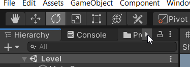

# 3. Layout

When you open Unity first time, it is easy to get confused with all the windows and tools that show up. As such, Unity allows you to customize this layout to your liking and use those Views only that are currently required. Click-dragging any tab of any view helps us to move and position the View where we want it to be, we can also detach the Window from the Editor if we want. For eg, the Hierarchy Window is being click-dragged :

*The Project Panel* has been dragged and attached beside the Hierarchy tab in the picture below: 

*The Hierarchy tab* has been completely detached from the Editor and can be used just like this as shown below, which can now be said to be a “Floating Editor Window”: 

Note:🔴

- A View can have multiple tabs, in which case these tabs can be shown only one at a time, for eg, below, we can see Hierarchy and Project tabs in the same view, in this case, we can open up either the Project Tab or Hierarchy tab only one at a time, of course, tabs can be shifted elsewhere as shown above if they need to be viewed simultaneously.
    
    
    
- Whenever you are working in tabbed views, the “active” tab (the tab that has focus) has a thin blue stripe at the top, like in the above screenshot, you can see the Project tab having a thin blue stripe
- When multiple tabs are attached to a view that takes up more space than provided, Unity provided small directional arrows to look at the tabs that aren’t visible, for eg, below you can see 3 tabs in one view, but the Project tab isn’t visible, hence click on the arrow to show up :
    
    
    
    

- At any time, right-click can be used on a tab to show up the different options specific to it, for eg, the below is shown for the Console tab:
    
    
    
    

- Finally, once you have decided on your own layout of the editor with required tabs and views, you also have the option to save the layout using the *Layout* options found under the layout dropdown (top right corner of Editor), then you can quickly switch back to your saved layouts if any changes are made to the current layout at any point:
    
    
    

<aside>

> 💡 🚀 **[Join Discord Server](https://discord.gg/J5zDscnzms) → Get your doubts solved by experts instantly**

</aside>

---
